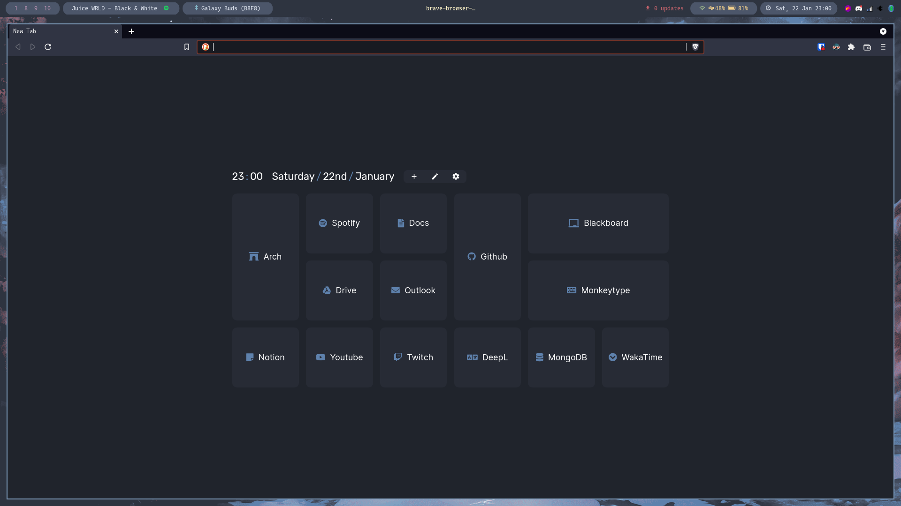

# Dotfiles


## Suggestions for a good README

## Name

My Dotfiles

## Description

## Applications Used

* Window Manager: i3-gaps
* Notification: dunst
* Compositer: Picom
* Bar: polybar
* Terminal : alacritty
* Shell: zsh (oh-my-zsh)
* Pdf Viewer: zathura
* File Broswer: ranger
* Music: Spotify
* Tmux

## Screenshot





## Installation

```
git clone https://github.com/Super-Yojan/dotfiles ~/
cd dotfiles
stow -d .dotfiles -t ~/ *
```
For this to work you need fresh install with very mimnimal configs.


## License


